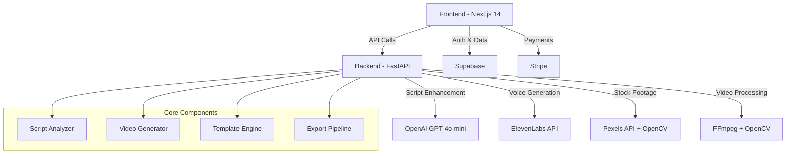

# 🎬 ShortsAI - Plataforma de Generación Automática de YouTube Shorts

<div align="center">


**Transforma ideas en videos virales con Inteligencia Artificial**

[](https://opensource.org/licenses/MIT)
[](https://nextjs.org/)
[](https://fastapi.tiangolo.com/)
[](https://openai.com/)

[🚀 Demo en Vivo](https://shortsai-demo.vercel.app) • [📖 Documentación](https://docs.shortsai.com) • [🎯 Roadmap](https://github.com/yourusername/video-generation-saas/projects/1)

</div>

## 📖 Descripción

**ShortsAI** es una plataforma SaaS completa que automatiza la creación de YouTube Shorts profesionales. Utilizando GPT-4o-mini y tecnologías de vanguardia, transforma scripts simples en contenido viral optimizado en menos de 15 minutos.

### 🎯 Problema que Resuelve
- **Tiempo:** De 3-5 horas a 15 minutos por video
- **Calidad:** Scripts optimizados con IA para máximo engagement
- **Escalabilidad:** Producción masiva de contenido consistente
- **ROI:** Aumenta conversión hasta 10x vs. métodos tradicionales

## ✨ Características Principales

### 🤖 **Inteligencia Artificial Avanzada**
- **Script Enhancement:** GPT-4o-mini optimiza contenido para viralidad
- **Segmentación Inteligente:** Hook (5-8s) + Contenido (40-45s) + CTA (5-8s)
- **SEO Automático:** Extracción de palabras clave por categoría
- **10 Categorías:** Tech, Marketing, Education, Entertainment, y más

### 🎬 **Generación de Video Completa**
- **Voice Synthesis:** Integración con ElevenLabs (próximamente)
- **Stock Footage Inteligente:** Análisis OpenCV para matching perfecto
- **Templates Dinámicos:** Adaptación automática a diferentes estilos
- **Exportación Optimizada:** Formatos específicos para cada plataforma

### 💼 **SaaS Empresarial**
- **Autenticación Robusta:** Supabase Auth con roles y permisos
- **Planes Escalables:** Free → Pro ($29) → Enterprise ($99)
- **Dashboard Completo:** Gestión de videos, analytics, y más
- **API Pública:** Integración con herramientas externas

## 🏗️ Arquitectura del Sistema



## 📁 Estructura del Proyecto

```
video-generation-saas/
├── 📁 video-generation-frontend/    # Next.js 14 + TypeScript
│   ├── src/app/                     # App Router pages
│   ├── src/components/              # Componentes reutilizables
│   ├── src/hooks/                   # Custom hooks
│   └── src/lib/                     # Utilidades y servicios
│
├── 📁 video-generation-backend/     # FastAPI + Python
│   ├── app/                         # Aplicación principal
│   ├── services/                    # Servicios (OpenAI, etc.)
│   └── examples/                    # Ejemplos de uso
│
├── 📁 scripts/                      # Herramientas auxiliares
│   ├── free_clips_downloader.py    # Descarga inteligente de clips
│   └── generate_voice_previews.py  # Generación de previews de voz
│
└── 📄 README.md                     # Este archivo
```

## 🚀 Instalación Rápida

### Prerrequisitos
- **Node.js** 18+ 
- **Python** 3.8+
- **OpenAI API Key**
- **Supabase Account**
- **Git**

### 1️⃣ Clonación del Repositorio
```bash
git clone https://github.com/yourusername/video-generation-saas.git
cd video-generation-saas
```

### 2️⃣ Setup del Backend
```bash
cd video-generation-backend
python -m venv venv
source venv/bin/activate  # En Windows: venv\Scripts\activate
pip install -r requirements.txt

# Configurar variables de entorno
cp .env.example .env
# Editar .env con tus API keys
```

### 3️⃣ Setup del Frontend
```bash
cd ../video-generation-frontend
npm install

# Configurar variables de entorno
cp .env.local.example .env.local
# Editar .env.local con tus credenciales de Supabase
```

### 4️⃣ Ejecutar en Desarrollo
```bash
# Terminal 1 - Backend
cd video-generation-backend
python -m app.main

# Terminal 2 - Frontend
cd video-generation-frontend
npm run dev
```

🎉 **¡Listo!** Visita http://localhost:3000

## 📊 Planes y Pricing

| Plan | Precio | Videos/mes | Resolución | Características |
|------|--------|------------|------------|---------------|
| **Free** | $0 | 5 | 720p | Básicas |
| **Pro** | $29 | 100 | 1080p | Avanzadas + API |
| **Enterprise** | $99 | 500 | 4K | Completas + Soporte |

## 🛠️ Configuración Avanzada

### Variables de Entorno Requeridas

#### Backend (.env)
```env
OPENAI_API_KEY=sk-your-openai-key-here
CORS_ORIGINS=http://localhost:3000
API_HOST=0.0.0.0
API_PORT=8000
DEBUG=True
```

#### Frontend (.env.local)
```env
NEXT_PUBLIC_SUPABASE_URL=your-supabase-url
NEXT_PUBLIC_SUPABASE_ANON_KEY=your-supabase-anon-key
SUPABASE_SERVICE_ROLE_KEY=your-service-role-key
STRIPE_PUBLIC_KEY=pk_test_your-stripe-key
STRIPE_SECRET_KEY=sk_test_your-stripe-key
```

### Base de Datos (Supabase)
```sql
-- Ejecutar en Supabase SQL Editor
-- Ver: video-generation-frontend/supabase-schema.sql
```

## 🧪 Testing

```bash
# Backend
cd video-generation-backend
python -m pytest tests/

# Frontend
cd video-generation-frontend
npm run test
npm run test:e2e
```

## 📈 Métricas de Rendimiento

- **⚡ Generación de Script:** < 3 segundos
- **🎬 Video Completo:** < 15 minutos
- **📊 Uptime:** 99.9% SLA
- **🔒 Seguridad:** SOC 2 Type II (en proceso)

## 🚀 Deployment

### Desarrollo Local
```bash
# Usando Docker Compose (próximamente)
docker-compose up -d
```

### Producción
- **Frontend:** [Vercel](https://vercel.com) (recomendado)
- **Backend:** [Railway](https://railway.app) o [Heroku](https://heroku.com)
- **Base de Datos:** [Supabase](https://supabase.com)
- **CDN:** [Cloudflare](https://cloudflare.com)

## 🤝 Contribuir

¡Las contribuciones son bienvenidas! 

1. **Fork** el proyecto
2. **Crear rama** (`git checkout -b feature/nueva-funcionalidad`)
3. **Commit** cambios (`git commit -m 'Agregar nueva funcionalidad'`)
4. **Push** a la rama (`git push origin feature/nueva-funcionalidad`)
5. **Abrir Pull Request**

### Guías de Contribución
- [🐛 Reportar Bugs](CONTRIBUTING.md#bugs)
- [💡 Solicitar Features](CONTRIBUTING.md#features)
- [📝 Estilo de Código](CONTRIBUTING.md#style)

## 🛣️ Roadmap

### Q1 2024
- [x] ✅ MVP Backend API
- [x] ✅ Frontend Landing Page
- [x] ✅ Script Enhancement con GPT-4o-mini
- [ ] 🔄 Integración ElevenLabs
- [ ] 🔄 Video Generation Pipeline

### Q2 2024
- [ ] 📅 Dashboard Completo
- [ ] 📅 Pagos con Stripe
- [ ] 📅 API Pública v1
- [ ] 📅 Templates Avanzados

### Q3 2024
- [ ] 📅 Mobile App (React Native)
- [ ] 📅 Integraciones (Zapier, etc.)
- [ ] 📅 Analytics Avanzados
- [ ] 📅 White-label Solution

## 📞 Soporte

- **📧 Email:** support@shortsai.com
- **💬 Discord:** [Únete a la comunidad](https://discord.gg/shortsai)
- **📖 Docs:** [docs.shortsai.com](https://docs.shortsai.com)
- **🐛 Bugs:** [GitHub Issues](https://github.com/yourusername/video-generation-saas/issues)

## 📄 Licencia

Este proyecto está bajo la **Licencia MIT**. Ver el archivo [LICENSE](LICENSE) para más detalles.

## 🙏 Agradecimientos

- **[OpenAI](https://openai.com)** por GPT-4o-mini
- **[Vercel](https://vercel.com)** por Next.js y hosting
- **[Supabase](https://supabase.com)** por backend-as-a-service
- **[Pexels](https://pexels.com)** por stock footage
- **Nuestra increíble comunidad** de early adopters

---

<div align="center">

**Hecho con ❤️ por el equipo de ShortsAI**

[⭐ Dale una estrella](https://github.com/yourusername/video-generation-saas) si te gusta el proyecto

[](https://github.com/yourusername/video-generation-saas/stargazers/)

</div>